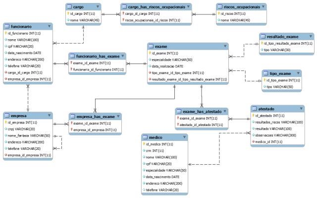

**Projeto de Banco de dados**

Um projeto de banco de dados é fundamental para o êxito da implementação do mesmo em um projeto. Em grandes projetos por exemplo, existem equipes que possuem a responsabilidades de cuidar apenas do banco de dados. Esses profissionais tem a responsabilidade de cuidar da base de dados, onde atualmente é considerado um produto extremamente valioso, pois a partir de dados bem organizados e computados, é possível definir métricas de uso, traçar caminhos de utilização, em resumo com o banco de dados é possível traçar caminhos para as aplicações.

Dessa forma, É importante garantir, a confiabilidade nos dados, a segurança, desempenho e a disponibilidade. Esses Objetivos são atingidos principalmente com um bom planajamento, esse planejamento pode ser conhecimento como um projeto de banco de dados, uma parte importante do desenvolvimento de qualquer aplicação que utilize dessa tecnologia que por muitas vezes é negligenciada e pode acaba gerando custos e problemas inesperados.

**1º Passo**

**Modelo conceitual**: Representa os conceitos do negócio e as associações existentes entre estes conceitos. Também são representados os atributos assim como as regras de negócio que regulam as associações e conceitos do negócio. Este modelo é independente da tecnologia de implementação usada para o banco de dados e por isto é a etapa mais adequada para o envolvimento do usuário que não precisa ter conhecimentos técnicos.

**Caracteristicas**

- Visão Geral do negócio
  - Facilidade de entendimento entre usuários e desenvolvedores
    - Possui somente as entidades, relacionamentos e atributos principais

**2º Passo**

**Modelo Lógico**: Representa as estruturas de dados a serem implementadas e suas características considerando os limites impostos pelo modelo de dados usado para implementação do banco de dados.(banco de dados hierárquico , banco de dados de rede, banco de dados relacional ,etc.).

**Caracteristicas**

- É gerado a paratir do modelo conceitual, ou seja, é facilmente obtido.
  - Possui entidades associativas em lugar de relacionamentos n:m
    - Define as chaves primárias das entidades
      - Normalização até a 3a. forma normal
        - As Entidades e atributos são documentados em um Dicionário de Dados

**3º Passo**

**Modelo Físico\***: Este modelo vai representar a implementação do modelo lógico, utilizando alguma tecnologia de banco de dados, a qual vai ser escolhida levando em consideração o requisitos não funcionais como desempenho, disponibilidade e segurança que foram levantados. 

**Caracteristicas**

 Elaborado a partir do modelo lógico

- Pode variar segundo a tecnologia usada para implementação do banco de dados
- Possui tabelas físicas (log , lider , etc.)
- Possui colunas físicas (replicação)

Neste modelo utiliza-se da linguagem SQL, que é a linguagem padrão para controlar e usar estrutura de dados, junto com um gereciador de banco de dados conhecidos como sgbds, podendo assim ter total controle de gerenciamento da base dados.

**SGBDs**

Os Sistemas de Gerenciamento de Banco de Dados, são softwares que nos auxiliamno gerenciamento de uma base deados, são programas que utilizados para controlar o banco de dados. 

Existem vários sgbds no mercado, de código aberto e privados que comumente são utilizados por grandes empresas, temos como exemplo:

**Oracle**

**MySQL**

**SQL Server PostgreSQL MongoDB**

**DB2**

**Cassandra Microsoft Access Redis**

**SQLite**

**MariaDB**

É de suma importância entender do sgdb a qual está utilizando, pois ele deve atender os requisitos não funcionais do sistemas, para isso cada sgbd possui diversas fontes de como funcionam, caso código aberto alimentado pela comunidade e caso código fechado alimentado pela empresa que faz o suporte. Nesse cenário, a escolha da**tecnologia (SGBD)**certa para o seu projeto, empreendimento, manutenção de um projeto antigo ou até migração para uma nova infraestrutura não é uma decisão fácil. Estude bastante para escolher a tecnologia que melhor se adapta às suas necessidades como profissional de TI ou tomador de decisão.
